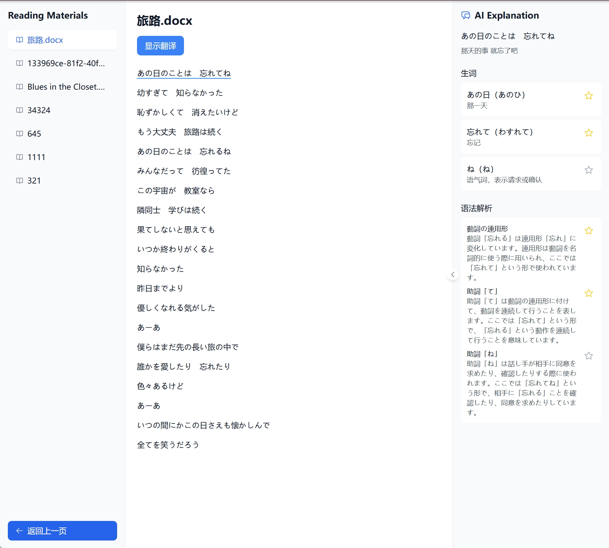

<!--  -->

# TextLingo📕

  
  

[**English**](/README.md)｜[**中文**](/README_cn.md)

TextLingo is an innovative foreign language reading and learning tool that allows you to learn foreign languages using any text content of interest, transforming boring language learning into an enjoyable reading experience.

TextLingo uses AI technology to intelligently analyze texts and provides detailed grammar explanations and word definitions to help you better understand the content.

# Version Information

| Version | Description | Link |
|---------|-------------|------|
| Web Version |  Most convenient, no installation required. Currently free, but advanced features may be charged in the future. Best used with a VPN | https://textlingo.app/zh/login |
| Open Source Version | 🆓 Most free, completely free, requires Docker installation | https://github.com/hikariming/TextLingo |
| iOS Version | Under development... | TBD.... |

## Core Features

- 🎯 **Smart Text Import**: One-click import of multiple formats (URL, Word, Markdown, etc.), automatic translation and learning vocabulary generation
- 📖 **Immersive Reading Experience**:
  - Professional reader interface design
  - Real-time language switching
  - Instant word lookup and grammar parsing
- 🔍 **Deep Learning Assistance**:
  - Intelligent word explanations
  - Detailed grammar explanations (supports Chinese-Japanese-English translation)
  - Context understanding support
  - Pronunciation guidance and correction

# Use Cases 🎬

- 📚 Lyrics Learning: Learn Japanese through music lyrics 🎵, convenient for singing along at concerts
- 📰 News Reading: Read Japanese and English news (The Economist, idol reports, etc.), stay updated with current events
- 📝 Vocabulary Memorization: Memorize words through lyrics, news, and other texts
- 📖 Grammar Practice: Practice grammar through reading foreign language materials

## Coming Soon
- 📝 Text Intelligent Dialogue: Supports highlight learning and real-time Q&A
- 📚 Personalized Exercise System: Targeted word and grammar practice

# How to Run

Refer to [Running Documentation](docs/HowToRun_en.md)

## Supported Languages
- 🇨🇳 Chinese (Simplified)
- 🇺🇸 English
- 🇯🇵 Japanese
  - Supports kana notation
  - Automatic grammar analysis
- More languages coming soon, or submit PR or issue

## Current Version

Development version v0.1.4
Please check the running documentation for how to run the development version

