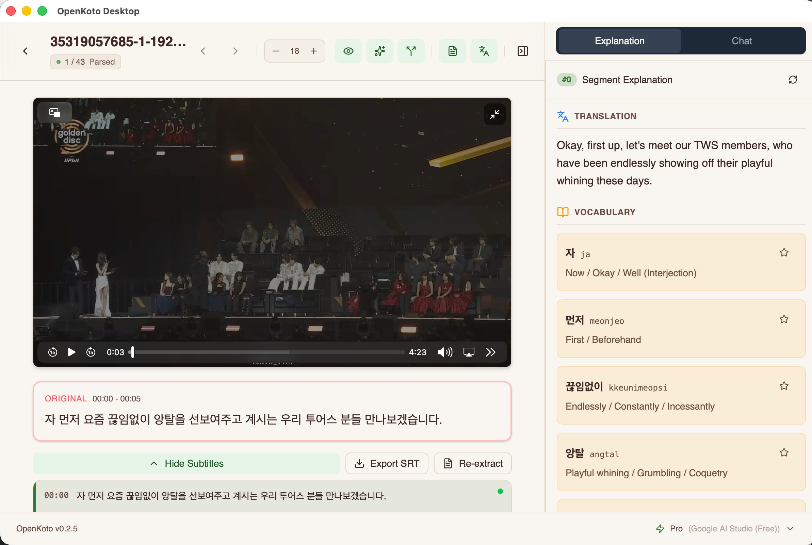

<div align="center">

<!--  -->

# OpenKoto Desktop 📕

**开源语言学习工具 | Language Reactor 与 Duolingo 的免费开源替代品**

<p align="center">
  <a href="https://tauri.app" target="_blank"></a>
  <a href="https://github.com/hikariming/OpenKoto/stargazers" target="_blank"></a>
  <a href="https://github.com/hikariming/OpenKoto/blob/main/LICENSE" target="_blank"></a>
</p>

[**English**](/README.md)｜[**中文**](/README_cn.md)｜[**日本語**](/README_ja.md)

</div>

> 📢 **提示**: 本项目原名 **TextLingo**，现已更名为 **OpenKoto**（Open + 言/こと，日语中"话语"的意思），以更好地体现我们开源阅读、翻译和语言学习的愿景。

## 什么是 OpenKoto？

OpenKoto Desktop 是一款**开源的 AI 驱动语言学习应用**，让你可以通过任何感兴趣的内容进行沉浸式语言学习。它不仅是语言学习工具，还是一款**出色的阅读器和翻译工具**。与传统语言学习应用不同，OpenKoto 支持从**真实内容**中学习 — 歌词、新闻、博客或任何你感兴趣的文本。

基于 **Tauri + React + Rust** 构建，本地运行，**快速、安全、保护隐私**。

> 🎯 **适合人群**: 日语学习者、英语学习者、多语言爱好者，以及所有希望通过有趣内容学习语言的人！



## 为什么选择 OpenKoto？

| 功能 | OpenKoto | 传统应用 |
|------|-----------|----------|
| 📖 从任意内容学习 | ✅ 导入网页、文档、歌词 | ❌ 固定课程 |
| 🔒 隐私保护 | ✅ 100% 本地处理 | ❌ 依赖云端 |
| 🆓 免费开源 | ✅ Apache 2.0 许可证 | ❌ 需要订阅 |
| 🌍 支持 100+ 语言 | ✅ 学习与转录 | ❌ 语言有限 |
| 🖥️ 原生桌面性能 | ✅ Tauri + Rust | ❌ 网页端延迟 |
| 🤖 AI 智能解释 | ✅ 智能上下文分析 | ❌ 有限反馈 |

## 下载

| 版本 | 说明 | 链接 |
|------|------|------|
| **桌面版** | **推荐** 🖥️ 原生性能，本地数据，支持 Mac/Windows/Linux | [下载最新版本](https://github.com/hikariming/OpenKoto/releases) |
| 网页版 | 在线使用，无需安装 | [https://openkoto.app](https://openkoto.app) |
| 源代码 | 🆓 完全开源，Apache 2.0 许可证 | [GitHub 仓库](https://github.com/hikariming/OpenKoto) |


## 核心特性

- 🎯 **多格式智能支持** - 一键导入网页、**PDF、EPUB、TXT**、Word、Markdown 等格式，自动翻译并生成词汇表
- 📖 **沉浸式阅读模式**
  - 专业阅读器界面设计，支持文章与图书
  - 多语言实时切换
  - 即时查词与语法解析
- 🔍 **AI 学习助手**
  - 基于上下文的智能词汇解释
  - 详细语法讲解（中日英三语）
  - 发音指导与纠正
- 📝 **交互式 AI 问答** - 高亮任意文本，实时 AI 问答

## 使用场景 🎬

- 📚 **全能阅读素材** - 导入 PDF、EPUB 电子书或 TXT 文件，进行深度阅读与分析
- 🎵 **通过歌词学日语** - 掌握发音，为演唱会跟唱做准备
- 📰 **阅读外语新闻** - 经济学人、NHK 新闻等，即时翻译理解
- 🎬 **动漫学习** - 通过转录功能理解你喜欢的日语动漫

## 即将推出

- 📚 个性化词汇和语法练习系统
- 🎥 YouTube 视频学习支持

## 快速开始

### 环境要求
- Node.js (v18+)
- Rust

### 开发环境搭建

1. **克隆仓库并下载依赖文件**（ffmpeg 和 yt-dlp 用于视频功能）:
   ```bash
   git clone https://github.com/hikariming/OpenKoto.git
   cd OpenKoto
   chmod +x script/download_binaries.sh
   ./script/download_binaries.sh
   ```

2. **安装依赖**:
   ```bash
   cd textlingo-desktop
   npm install
   ```

3. **启动开发模式**:
   ```bash
   npm run tauri dev
   ```

更多详情请参考 [开发文档](docs/HowToRun_cn.md)。

## 常见问题

### macOS: "应用已损坏，打不开"
这是 macOS Gatekeeper 安全机制导致的。请在终端运行：
```bash
sudo xattr -r -d com.apple.quarantine /Applications/OpenKoto\ Desktop.app
```

## 支持语言

**支持 100+ 语言**的学习与转录，包括：

- 🇯🇵 日语（支持假名标注和自动语法分析）
- 🇺🇸 英语
- 🇨🇳 中文（简体和繁体）
- 🇰🇷 韩语
- 🇫🇷 法语
- 🇩🇪 德语
- 🇪🇸 西班牙语
- 🇮🇹 意大利语
- 🇵🇹 葡萄牙语
- 以及更多...

欢迎提交 PR 支持更多语言！

## 技术栈

- **前端**: React + TypeScript + Tailwind CSS
- **后端**: Tauri + Rust
- **AI**: 兼容 OpenAI API

## 参与贡献

欢迎贡献代码！请随时提交 PR 或创建 Issue。

## 当前版本

**v0.1.4** (开发版)

## 作者的其他项目

### 日区 AI 导航站
[aitoolsjapan](https://aitoolsjapan.com/) 是一个日区 AI 导航站，在这里你可以发现各类与人工智能相关的日本地区的工具和资源，帮助你快速找到所需的 AI 服务和应用。

### Dify 使用学习分享站
[usedify](https://usedify.app/) 是一个专注于 Dify 的使用学习分享站。在这里，你可以学习到 Dify 相关的使用技巧、经验分享以及各种实用的案例，助力你更好地掌握和运用 Dify 工具。

### 基于感兴趣文本学习外语的站
[openkoto](https://openkoto.app/) 是一个基于自己感兴趣文本学习外语的站。通过该网站，你能够利用自己感兴趣的文本内容作为学习材料，以更有趣和高效的方式提升外语水平。

## 许可证

Apache License 2.0 - 详见 [LICENSE](LICENSE)

---

<div align="center">

**⭐ 如果 OpenKoto 对你的语言学习有帮助，请给我们一个 Star！⭐**

[报告问题](https://github.com/hikariming/OpenKoto/issues) · [功能建议](https://github.com/hikariming/OpenKoto/issues) · [参与讨论](https://github.com/hikariming/OpenKoto/discussions)

</div>
