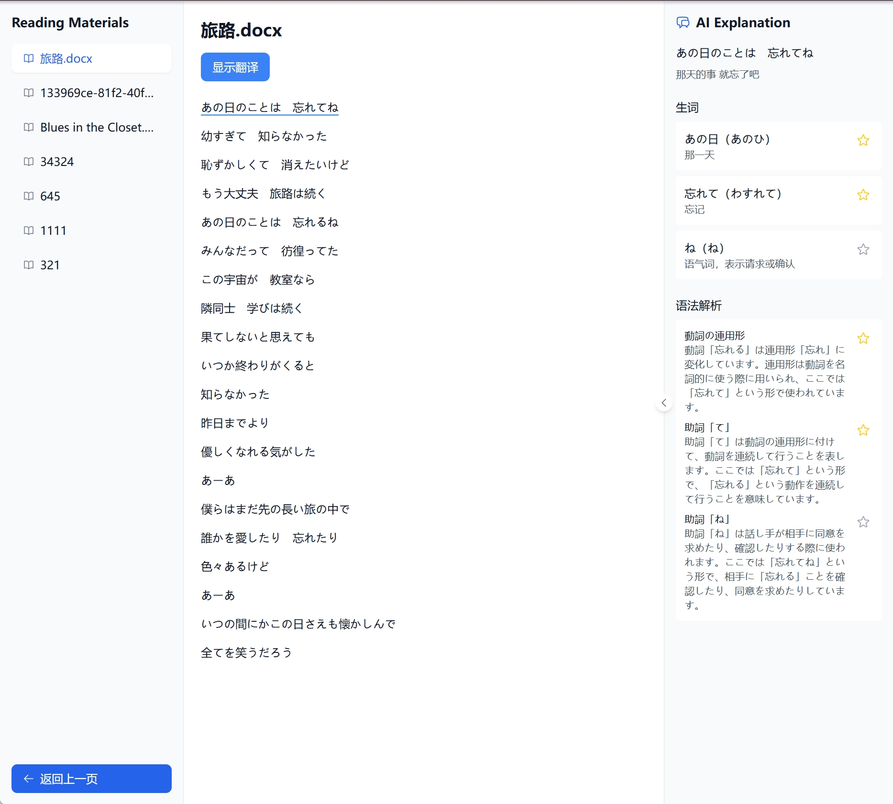

<div align="center">

<!--  -->

# OpenKoto Desktop 📕

**オープンソース言語学習ツール | Language Reactor・Duolingo の無料代替アプリ**

<p align="center">
  <a href="https://tauri.app" target="_blank"></a>
  <a href="https://github.com/hikariming/OpenKoto/stargazers" target="_blank"></a>
  <a href="https://github.com/hikariming/OpenKoto/blob/main/LICENSE" target="_blank"></a>
</p>

[**English**](/README.md)｜[**中文**](/README_cn.md)｜[**日本語**](/README_ja.md)

</div>

> 📢 **お知らせ**: このプロジェクトは以前 **TextLingo** という名前でした。オープンソース言語学習のビジョンをより反映するため、**OpenKoto**（Open + 言/こと）に改名しました。

## OpenKoto とは？

OpenKoto Desktop は、**オープンソースの AI 搭載言語学習アプリケーション**です。好きなコンテンツを使って没入型の学習体験を実現します。従来の言語学習アプリとは異なり、OpenKoto は**実際のコンテンツ**から学べます — 歌詞、ニュース記事、ブログ、興味のあるテキストなんでも！

**Tauri + React + Rust** で構築され、ローカルで動作するため、**高速で完全にプライバシーを保護**します。

> 🎯 **こんな方におすすめ**: 英語学習者、中国語学習者、多言語学習者、そして楽しみながら言語を学びたいすべての人！



## なぜ OpenKoto？

| 機能 | OpenKoto | 従来のアプリ |
|------|-----------|--------------|
| 📖 好きなコンテンツで学習 | ✅ URL、文書、歌詞をインポート | ❌ 固定カリキュラム |
| 🔒 プライバシー重視 | ✅ 100%ローカル処理 | ❌ クラウド依存 |
| 🆓 無料・オープンソース | ✅ Apache 2.0 ライセンス | ❌ サブスク制 |
| 🌍 100以上の言語対応 | ✅ 学習と文字起こし | ❌ 対応言語が限定的 |
| 🖥️ ネイティブデスクトップ性能 | ✅ Tauri + Rust | ❌ Web ベースで遅延 |
| 🤖 AI による解説 | ✅ スマートな文脈分析 | ❌ 限定的なフィードバック |

## ダウンロード

| バージョン | 説明 | リンク |
|------------|------|--------|
| **デスクトップ版** | **おすすめ** 🖥️ ネイティブ性能、ローカルデータ、Mac/Windows/Linux 対応 | [最新版をダウンロード](https://github.com/hikariming/OpenKoto/releases) |
| Web 版 | インストール不要、オンラインで利用可能 | [https://openkoto.app](https://openkoto.app) |
| ソースコード | 🆓 完全オープンソース、MIT ライセンス | [GitHub リポジトリ](https://github.com/hikariming/OpenKoto) |

## 主な機能

- 🎯 **スマートテキストインポート** - URL、Word、Markdown などからワンクリックでインポート、自動翻訳と語彙抽出
- 📖 **没入型リーディングモード**
  - プロフェッショナルなリーダーインターフェース
  - リアルタイム言語切り替え
  - 即時単語検索と文法解析
- 🔍 **AI 学習アシスタント**
  - 文脈に基づくインテリジェントな単語説明
  - 詳細な文法解説（日中英対応）
  - 発音ガイダンスと矯正
- 📝 **パーソナライズ学習** - テキストをハイライトして AI にリアルタイムで質問

## 活用シーン 🎬

- 🎵 **歌詞で英語・中国語を学ぶ** - 好きな曲で発音をマスター
- 📰 **外国語ニュースを読む** - The Economist、中国のニュースなど、即座に翻訳
- 📚 **リアルコンテンツで学習** - 興味のある記事、ブログ、ドキュメントをインポート
- 🎬 **アニメで学習** - 文字起こし機能で好きなアニメを理解

## 近日公開

- 📝 AI との対話型テキスト Q&A
- 📚 パーソナライズされた語彙・文法練習システム
- 🎥 YouTube 動画学習サポート

## はじめ方

### 必要条件
- Node.js (v18+)
- Rust

### 開発環境のセットアップ

1. **リポジトリをクローンしてバイナリをダウンロード**（動画機能用の ffmpeg と yt-dlp）:
   ```bash
   git clone https://github.com/hikariming/OpenKoto.git
   cd OpenKoto
   chmod +x script/download_binaries.sh
   ./script/download_binaries.sh
   ```

2. **依存関係をインストール**:
   ```bash
   cd textlingo-desktop
   npm install
   ```

3. **開発モードで実行**:
   ```bash
   npm run tauri dev
   ```

詳細は [開発ドキュメント](docs/HowToRun_en.md) をご覧ください。

## トラブルシューティング

### macOS: 「アプリが壊れているため開けません」
macOS Gatekeeper が原因です。ターミナルで以下を実行してください：
```bash
sudo xattr -r -d com.apple.quarantine /Applications/OpenKoto\ Desktop.app
```

## 対応言語

**100以上の言語**での学習と文字起こしに対応：

- 🇯🇵 日本語（ふりがな対応・自動文法分析）
- 🇺🇸 英語
- 🇨🇳 中国語（簡体字・繁体字）
- 🇰🇷 韓国語
- 🇫🇷 フランス語
- 🇩🇪 ドイツ語
- 🇪🇸 スペイン語
- 🇮🇹 イタリア語
- 🇵🇹 ポルトガル語
- その他多数...

追加言語対応のPR歓迎！

## 技術スタック

- **フロントエンド**: React + TypeScript + Tailwind CSS
- **バックエンド**: Tauri + Rust
- **AI**: OpenAI 互換 API

## コントリビュート

貢献を歓迎します！PR や Issue をお気軽にどうぞ。

## 現在のバージョン

**v0.1.4** (開発版)

## 作者の他のプロジェクト

### 日本 AI ナビゲーションサイト
[aitoolsjapan](https://aitoolsjapan.com/) は日本の AI ナビゲーションサイトです。ここでは、日本地域の AI 関連ツールやリソースを幅広く発見できます。最先端の AI 技術を探索したい方も、実用的な AI ツールをお探しの方も、必要な AI サービスやアプリケーションを素早く見つけられる便利なハブです。

### Dify 使用方法・学習共有プラットフォーム
[usedify](https://usedify.app/) は Dify の使用方法と学習に特化したプラットフォームです。このサイトでは、Dify の使い方のコツ、実践的な経験共有、ケーススタディなど、価値あるコンテンツにアクセスできます。Dify を始めたばかりの初心者から、高度な機能をマスターしたい経験者まで、Dify ツールを最大限に活用するための知識とヒントを提供します。

### 興味のあるテキストで外国語を学ぶサイト
[openkoto](https://openkoto.app/) は、興味のあるテキストで外国語学習ができるプラットフォームです。従来の語学教材の代わりに、好きな小説、記事、ブログなど、個人の興味に合わせた素材で学習できます。このユニークなアプローチにより、好きなトピックを探索しながら、より楽しく効果的に語学力を向上させることができます。

## ライセンス

Apache License 2.0 - 詳細は [LICENSE](LICENSE) をご覧ください

---

<div align="center">

**⭐ OpenKoto が言語学習に役立ったら、Star をお願いします！⭐**

[バグ報告](https://github.com/hikariming/OpenKoto/issues) · [機能リクエスト](https://github.com/hikariming/OpenKoto/issues) · [ディスカッション](https://github.com/hikariming/OpenKoto/discussions)

</div>
