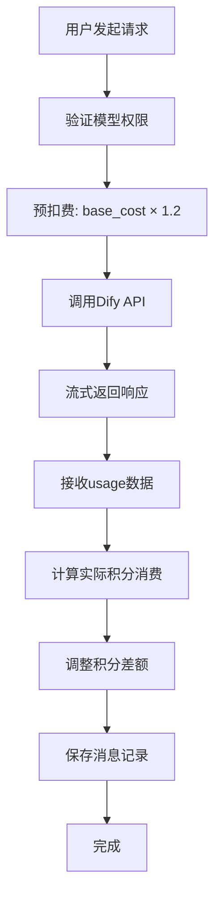
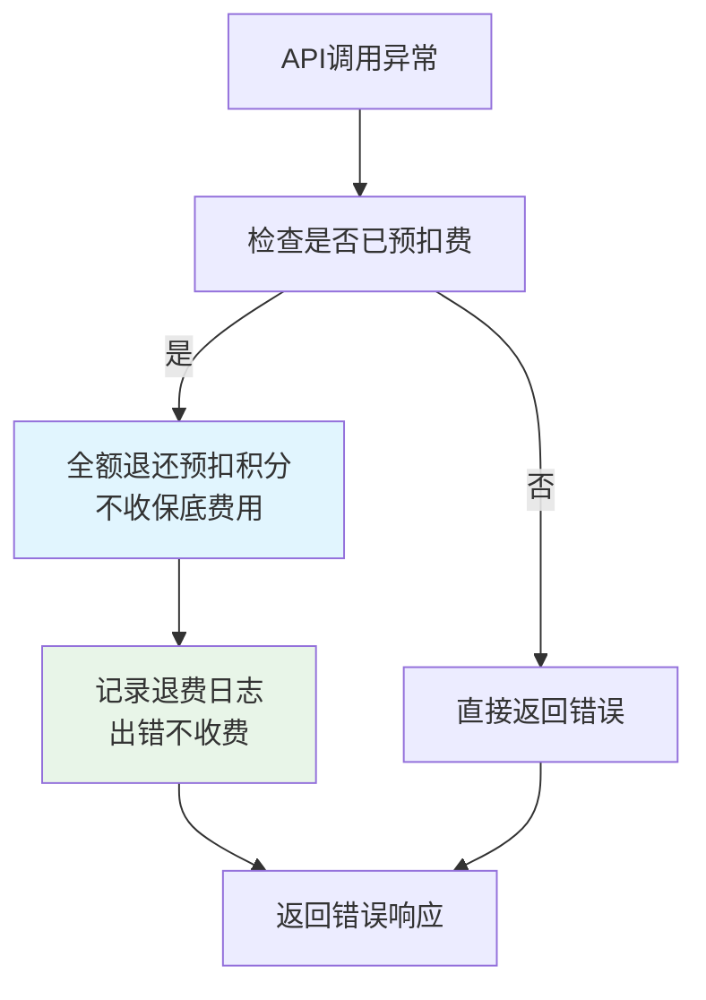

# 通用助手API计费优化文档

## 📋 概述

本次优化针对 `/api/v1/universal-assistant/chat` 接口的计费逻辑进行了全面改进，实现了更精确、公平和稳定的积分消费机制。

## 🎯 优化目标

- **保底消费机制**：确保每次**成功的**API调用都有最低积分消费
- **精确计费**：基于实际token使用量进行准确计费
- **预扣费优化**：使用倍数预扣，避免积分不足问题
- **差额调整**：自动处理预扣与实际消费的差额
- **异常保护**：API调用失败时全额退费，**不收任何费用**（包括保底）

## 🚀 主要改进

### 1. 预扣费机制优化

**之前：** 只扣除模型的基础费用（base_cost）
```python
estimated_points = model_config.base_cost
```

**现在：** 使用预扣倍数，确保有足够的积分缓冲
```python
base_cost = model_config.base_cost
pre_charge_multiplier = 1.2  # 来自配置文件
estimated_points = max(int(base_cost * pre_charge_multiplier), base_cost)
```

### 2. 保底消费机制

**增强的积分计算：**
```python
def calculate_model_points(model_id: str, usage_data: Dict[str, Any]) -> int:
    # 基于实际token使用量计算
    usage_based_points = int(prompt_cost + completion_cost)
    
    # 应用保底消费：max(使用量, 基础费用, 最小费用)
    total_points = max(
        usage_based_points + base_cost, 
        base_cost, 
        min_points_charge
    )
    return total_points
```

### 3. 自动差额调整

**新增方法：**
```python
async def adjust_final_points(user_id: str, pre_deducted_points: int, actual_points: int):
    points_diff = actual_points - pre_deducted_points
    
    if points_diff > 0:
        # 实际消费更多，额外扣费
        additional_deduction()
    elif points_diff < 0:
        # 实际消费更少，退还差额
        refund_difference()
```

### 4. 公平计费原则 🎯

**核心理念：出错不收费，成功才收保底**

- ✅ **成功调用**：应用保底消费机制，确保服务成本覆盖
- ❌ **失败调用**：全额退费，不收取任何费用（包括保底费用）
- 🔄 **异常处理**：任何API错误、超时、网络问题都触发全额退费

```python
# 成功时：计算实际消费（包含保底）
actual_points = max(usage_based_points + base_cost, base_cost, min_points_charge)

# 失败时：全额退费
await refund_points(user_id, points_before, "API调用失败")  # 退还所有预扣费用
```

## 📊 计费规则详解

### 模型成本结构

根据 `dify_config.json` 配置：

| 模型 | 基础费用 | 输入成本(/1K) | 输出成本(/1K) | 会员要求 |
|------|----------|---------------|---------------|----------|
| glm45 | 3积分 | 4积分 | 8积分 | 免费 |
| kimik2 | 3积分 | 4积分 | 8积分 | 免费 |
| gemini25pro | 5积分 | 9积分 | 70积分 | Plus |
| claude4 | 5积分 | 15积分 | 75积分 | Plus |
| grok4 | 5积分 | 15积分 | 75积分 | Plus |

### 计费步骤

1. **预扣费**：`base_cost × 1.2`
2. **实际计算**：`(input_tokens × input_cost + output_tokens × output_cost) / 1000 + base_cost`
3. **保底机制**：`max(实际计算, base_cost, min_points_charge)`
4. **差额调整**：处理预扣与实际的差额

### 计费示例

**场景1：简短对话（GLM 4.5）**
- 输入：50 tokens，输出：100 tokens
- 预扣：`3 × 1.2 = 4积分`
- 实际：`(50×4 + 100×8)/1000 + 3 = 1.2 + 3 = 4.2积分`
- 保底：`max(4.2, 3, 1) = 4积分`
- 调整：`4 - 4 = 0`（无需调整）

**场景2：长对话（GLM 4.5）**
- 输入：1000 tokens，输出：2000 tokens
- 预扣：`3 × 1.2 = 4积分`
- 实际：`(1000×4 + 2000×8)/1000 + 3 = 20 + 3 = 23积分`
- 调整：需额外扣费 `23 - 4 = 19积分`

## 🔧 配置参数

在 `dify_config.json` 中的关键配置：

```json
{
  "billing_settings": {
    "pre_charge_multiplier": 1.2,     // 预扣倍数
    "min_points_charge": 1,           // 最小积分消费
    "max_points_charge": 1000,        // 最大积分消费
    "refund_unused_points": true,     // 是否退还未使用积分
    "calculation_precision": 2        // 计算精度
  }
}
```

## 🚦 API调用流程

### 正常流程



### 异常流程



## 🧪 测试验证

使用提供的测试文件 `test_universal_assistant_billing.py` 进行验证：

```bash
python test_universal_assistant_billing.py
```

### 测试覆盖

- ✅ 不同模型的积分计算
- ✅ 极少token使用量的保底消费
- ✅ 预扣费机制
- ✅ 差额调整逻辑
- ✅ 异常情况的退费
- ✅ 边界条件处理

## 📈 性能和优势

### 优势

1. **精确计费**：基于实际使用量，避免过度收费
2. **公平保底**：只对成功服务收取保底费，失败时不收任何费用
3. **用户友好**：预扣合理，多退少补，出错全退
4. **系统稳定**：异常时自动全额退费，避免用户资损
5. **配置灵活**：通过配置文件调整计费参数
6. **体验优化**：出错不收费的原则提升用户信任度

### 性能影响

- 新增1-2次数据库查询（积分调整）
- 计算复杂度略有增加
- 整体响应时间影响 < 50ms

## 🔍 监控和日志

### 关键日志

```log
模型 glm45 预扣 4 积分成功 (基础:3, 倍数:1.2)，剩余: 996
模型 glm45 积分计算: 使用量17 + 基础3 = 20 (保底:1)
用户 user123 积分调整: 预扣4 -> 实际20
用户 user123 需额外扣费 16 积分: 996 -> 980
```

### 监控指标

- 预扣成功率
- 差额调整频率
- 退费次数和原因
- 各模型平均消费

## 🛠️ 故障排查

### 常见问题

1. **积分调整失败**
   - 检查RPC函数是否正常
   - 验证用户权限
   - 查看数据库连接状态

2. **预扣费异常**
   - 确认用户积分余额
   - 检查模型配置
   - 验证权限验证逻辑

3. **计费不准确**
   - 检查Dify返回的usage数据
   - 验证模型配置文件
   - 确认计算逻辑

## 📝 总结

本次优化实现了更加精确、公平和稳定的计费机制，核心改进是**"出错不收费，成功才收保底"**的公平计费原则：

- **用户体验**：合理预扣，精确结算，**出错全额退费**
- **系统稳定**：异常保护，自动退费，**零风险用户体验**  
- **业务目标**：保底收费（仅成功时），成本覆盖
- **技术架构**：模块化设计，易于维护
- **公平原则**：只为实际获得的服务付费

### 🎉 关键亮点

- ✨ **用户友好**：API调用失败时不收取任何费用（包括保底费用）
- ✨ **成本合理**：成功调用时确保基础成本覆盖  
- ✨ **计费透明**：清晰的预扣-调整-结算流程
- ✨ **异常安全**：所有异常情况都有完善的退费机制

通过这些改进，通用助手API的计费系统更加完善和公平，真正做到了"用多少付多少，出错不收费"的理念。 